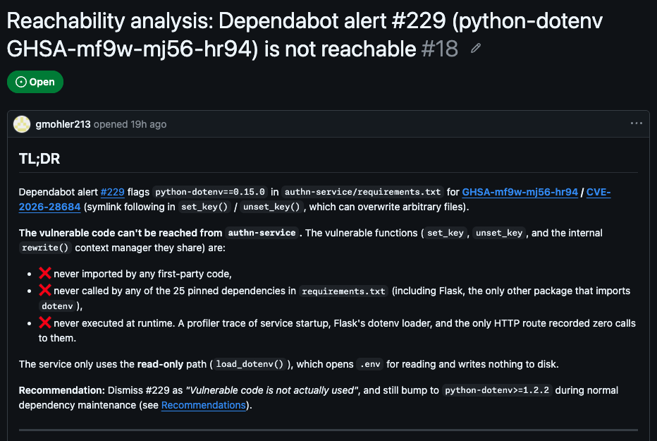
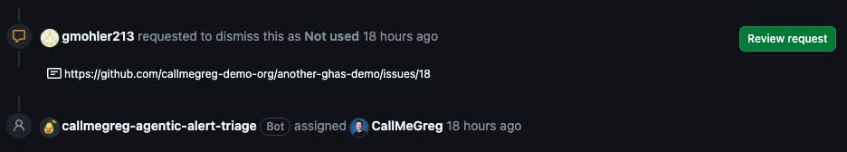
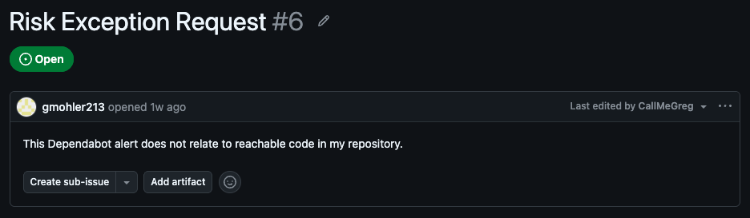
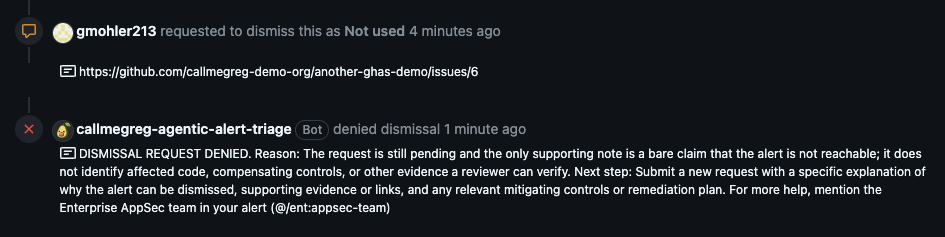

# Agentic Alert Triage

A GitHub App built with [Probot](https://probot.github.io/) that reviews
delegated security alert dismissal requests across an enterprise.
It supports deterministic policy checks, bounded agentic
review, or both.

## TL;DR

- A developer requests to dismiss a security alert and links an issue with
  their justification.
- The App checks the request and starts an agentic review in a central
  workflow repository.
- In about 3 minutes, the agent does one of two things:
  - **Deny:** the request is closed with guidance on what evidence is missing.
  - **Ready for human review:** the request stays open and the alert is
    assigned to an AppSec team member.
- The agent **never** approves a dismissal. A human on the AppSec team makes
  the final decision.

## How it works

1. **A requester asks to dismiss an alert.** The App responds to newly created
   delegated dismissal requests for code scanning, Dependabot, and secret
   scanning alerts. The signed webhook is the trusted snapshot of the request.

2. **The configured review mode determines the checks.**
   - Deterministic review checks whether the request comment meets configured
     phrase, pattern, and minimum-length requirements. Requests that fail are
     denied immediately.
   - Agentic review evaluates whether the dismissal reason is clear and
     relevant, the justification explains why dismissal is appropriate, and
     the supporting evidence is concrete, verifiable, and consistent with the
     alert.
   - `both` applies the deterministic requirements first, then sends passing
     requests through agentic review.

3. **The App dispatches the agentic workflow.** Passing requests are sent as a
   `repository_dispatch` to the central workflow repository. Before the agent
   runs, the workflow authenticates as the App, validates the dispatch, and
   fetches the current alert plus up to five linked issues from the same
   organization. The agent can only read that prepared context: it has no
   GitHub tools, no write access, and no network access beyond the model.

4. **The agent picks exactly one outcome.** A separate SafeOutput job applies
   it with the App's credentials and writes a decision summary to the workflow
   run.
   - `ready_for_review`: the request remains open and the alert is assigned to
     the enterprise AppSec team for a final human decision.
   - `deny`: the request is denied with an explanation of what is missing or
     inconsistent and what the requester should provide next.

   Existing code scanning and Dependabot assignees are preserved. Secret
   scanning supports one AppSec assignee, selected consistently from the team.

Requester comments, alert fields, and linked issue content are treated as
untrusted evidence, never as instructions. Secrets and credentials are excluded
or redacted, and ambiguous requests are denied rather than guessed.

### Example: ready for human review

[@gmohler213](https://github.com/gmohler213), the developer, asks to dismiss
Dependabot alert #229 for `python-dotenv` as "Vulnerable code is not actually
used" and links a detailed reachability analysis.

1. The linked issue traces the vulnerable functions and shows that the
   service, its dependencies, and a runtime trace never reach them.

   

2. About 3 minutes later, the agent decides the request is ready for human
   review. The App assigns the alert to an AppSec team member,
   [@CallMeGreg](https://github.com/CallMeGreg), and leaves the dismissal
   request open for them to make the final decision.

   

### Example: denied request

The same developer asks to dismiss the same alert, but links an issue that
only claims the code is unreachable.

1. The linked issue makes a one-sentence claim with no usage details,
   reachability analysis, or other evidence a reviewer can verify.

   

2. About 3 minutes later, the App denies the request and explains what is
   missing and what to provide next. The alert stays open.

   

## Setup

> [!TIP]
> Try opening this repository in the [GitHub Copilot App](https://github.com/github/app) and prompting Copilot in `Interactive` mode like this:
> > "Guide me through step by step setup of this app in my enterprise `YOUR_ENTERPRISE_SLUG` where I'll be installing the app in `YOUR_ORG_SLUGS` orgs.

### 1. Meet the prerequisites

- Node.js 22 or newer. GitHub Actions may use Node.js 24.
- Git and the [GitHub CLI](https://cli.github.com/).
- Delegated alert dismissal enabled in every monitored organization.

### 2. Prepare the local project

```bash
git clone https://github.com/CallMeGreg/agentic-alert-triage.git
cd agentic-alert-triage
npm ci
cp .env.example .env
```

Choose a strong webhook secret and set `WEBHOOK_SECRET` in `.env`. You will
enter the same value when registering the App. Leave `APP_ID` empty until
registration is complete; the private key file does not exist yet.

Do not start Probot yet. Complete the manual registration and credentials
steps below before running `npm start`.

### 3. Copy the project to a central repository (do not fork)

Choose an organization inside your enterprise to host the central workflow
repository. Create a new, independent repository containing this project,
**not a fork**. From the local clone, replace `YOUR_SECURITY_ORG` with that
organization's slug and run:

```bash
gh auth login --hostname github.com --scopes workflow
gh repo create YOUR_SECURITY_ORG/alert-triage --private --source=. --remote=control --push
gh repo edit YOUR_SECURITY_ORG/alert-triage --default-branch main
```

The authenticated account needs permission to create repositories in that
organization and push workflow files. These commands copy the committed
project, including its dependency manifests, scripts, and generated workflow,
to the new repository. They do not create a fork relationship or upload the
ignored `.env` and private key files.

Keep `origin` pointing to the source project and use the new `control` remote
for your enterprise's copy. Set `agentic.workflow_repository` to
`YOUR_SECURITY_ORG/alert-triage` in step 7; publish your configuration changes
before starting the service.

### 4. Create the enterprise AppSec team and assign its role

An enterprise owner should
[create the enterprise team](https://docs.github.com/en/enterprise-cloud@latest/admin/managing-accounts-and-repositories/managing-users-in-your-enterprise/create-enterprise-teams)
and [assign its role](https://docs.github.com/en/enterprise-cloud@latest/admin/managing-accounts-and-repositories/managing-roles-in-your-enterprise/assign-roles):

1. Open the enterprise's **People** tab, then **Enterprise teams**, and click
   **Create Enterprise team**. Create a team such as `appsec-team`, or reuse
   an existing enterprise AppSec team.
2. Open the team and use **Add members** to add the security reviewers. The
   team must have at least one member.
3. Under **People**, open **Enterprise roles**, then **Role assignments**.
   Click **Assign role**, select the enterprise team and the **Security
   Manager** role, and confirm the assignment.
4. Record the team's URL slug with the `ent:` prefix, such as
   `ent:appsec-team`, for `agentic.appsec_team_slug` in step 7.

Use one enterprise team across the monitored organizations, not separate
organization teams. The enterprise Security Manager role supplies repository
read and security-alert management access for the human reviewers.

### 5. Register the App directly under your enterprise

> [!IMPORTANT]
> [GitHub App manifests do not support enterprise-owned Apps or enterprise
> permissions](https://docs.github.com/en/enterprise-cloud@latest/apps/sharing-github-apps/registering-a-github-app-from-a-manifest).
> Do not use Probot's local registration wizard. This service requires
> enterprise ownership and rejects personal-account or organization-owned Apps.

Follow GitHub's
[enterprise App registration guide](https://docs.github.com/en/enterprise-cloud@latest/admin/managing-github-apps-for-your-enterprise/creating-github-apps-for-your-enterprise),
working with an enterprise owner to register and install the App:

1. Open your **enterprise settings**, then **GitHub Apps** under Settings, and
   click **New GitHub App**. Do not use your personal or organization developer
   settings.
2. Enter a globally unique App name and a homepage URL, such as your central
   workflow repository's URL.
3. Enable webhooks and set the webhook URL to your public Probot endpoint,
   `https://your-service.example/api/github/webhooks`. For local testing, use
   an approved HTTPS tunnel or forwarding relay; see
   [local webhook development](#local-webhook-development).
4. Enter the same webhook secret as `WEBHOOK_SECRET` in `.env` and keep SSL
   verification enabled. User authorization, OAuth callbacks, and device flow
   are not required; this App authenticates as the App and its installations.

Before creating the App, configure these permissions by their display names:

| Scope | Permission shown in GitHub | Access | Purpose |
|---|---|---|---|
| Enterprise | Enterprise teams | Read-only | Read the configured enterprise team's members |
| Organization | Organization dismissal requests for code scanning | Read & write | Receive and review code scanning requests |
| Organization | Organization dismissal requests for Dependabot | Read & write | Receive and review Dependabot requests |
| Organization | Secret scanning alert dismissal requests | Read & write | Receive and review secret scanning requests |
| Repository | Code scanning alerts | Read & write | Read alerts and assign ready alerts |
| Repository | Dependabot alerts | Read & write | Read alerts and assign ready alerts |
| Repository | Secret scanning alerts | Read & write | Read hidden-secret context and assign ready alerts |
| Repository | Contents | Write | Create `repository_dispatch` in the control repository |
| Repository | Issues | Read-only | Read bounded linked evidence |
| Repository | Metadata | Read-only | Access required repository metadata |

Configure these webhook subscriptions:

- Dismissal request for code scanning
- Dismissal request for Dependabot
- Dismissal request for secret scanning

Click **Create GitHub App**. Enterprise-owned Apps have internal visibility
and can be installed only within that enterprise.

On the App's settings page, record the **App ID** and **Client ID**, then click
**Generate a private key**. Save the downloaded PEM securely, for example as
`github-app.private-key.pem` in the project directory, matching
`PRIVATE_KEY_PATH` in `.env`. Never commit the key or `.env`.

For an existing enterprise-owned App, verify these permissions, subscriptions,
and webhook settings in its settings UI rather than registering another App.

### 6. Install the App

In the enterprise App's settings, open **Install App** or visit
`https://github.com/apps/YOUR_APP_SLUG/installations/new`.
Install the same App in three scopes:

1. **Enterprise account:** provides enterprise team membership access.
2. **Monitored organizations and repositories:** receives webhooks, performs
   denials, and reads or assigns alerts. Include repositories used for linked
   issue evidence.
3. **Control repository:** permits `repository_dispatch` and runs the agentic
   workflow.

> [!IMPORTANT]
> The enterprise installation does not replace organization or repository
> installations, and organization installations do not replace the enterprise
> installation. The incoming webhook token is never assumed to access the
> enterprise team API or control repository.

After initial setup, onboarding another organization requires only installing
the App, selecting the monitored repositories, and enabling delegated
dismissal. No separate AppSec team is needed.

### 7. Configure the service and workflow

[`config.yml`](config.yml) is loaded once when Probot starts. Keep the service
and control repository copies aligned:

```yaml
enterprise: your-enterprise
review_mode: both

required_pattern: "https://github\\.com/[a-zA-Z0-9-]+/[a-zA-Z0-9._-]+/issues/\\d+"
minimum_length: 20
case_sensitive: false

alert_types:
  - code_scanning
  - dependabot
  - secret_scanning

agentic:
  workflow_repository: your-security-org/alert-triage
  model: auto
  appsec_team_slug: ent:appsec-team
  staged: true

cache:
  app_identity_ttl_seconds: 600
  enterprise_installation_ttl_seconds: 600
  team_members_ttl_seconds: 300
  control_installation_ttl_seconds: 600
  delivery_dedupe_ttl_seconds: 900
  delivery_dedupe_max_entries: 1000
```

`enterprise` is required in every mode. The target organization always comes
from the validated webhook snapshot, never the control repository owner or
`GITHUB_REPOSITORY`.

| Key | Default | Description |
|---|---|---|
| `enterprise` | required | Enterprise URL slug that must own the App |
| `review_mode` | `both` | `deterministic`, `agentic`, or `both` |
| `required_phrase` | none | Phrase required in the requester comment |
| `required_pattern` | none | JavaScript regular expression required in the requester comment |
| `minimum_length` | none | Minimum trimmed requester-comment length |
| `case_sensitive` | `false` | Case-sensitive phrase and regex matching |
| `alert_types` | all three | Enabled alert categories |
| `agentic.workflow_repository` | Required | Central repository that runs the agentic workflows |
| `agentic.model` | `auto` | Copilot model used by the agentic workflow |
| `agentic.appsec_team_slug` | `ent:appsec-team` | Enterprise team with the Security Manager role; `ent:` is required |
| `agentic.staged` | `true` | Preview SafeOutput writes |
| `agentic.help_contact` | `Enterprise AppSec team in your alert (@/ent:appsec-team)` | Contact text included in agentic denials |
| `agentic.denial_message` | built-in | Optional agentic denial template |
| `denial_message` | built-in | Optional deterministic denial template |
| `cache.app_identity_ttl_seconds` | `600` | App ownership cache TTL, 1-3600 seconds |
| `cache.enterprise_installation_ttl_seconds` | `600` | Enterprise installation cache TTL, 1-3600 seconds |
| `cache.team_members_ttl_seconds` | `300` | Enterprise team membership cache TTL, 1-3600 seconds |
| `cache.control_installation_ttl_seconds` | `600` | Control installation cache TTL, 1-3600 seconds |
| `cache.delivery_dedupe_ttl_seconds` | `900` | Successful operation dedupe TTL, 1-3600 seconds |
| `cache.delivery_dedupe_max_entries` | `1000` | Delivery cache size, 1-10000 |

Agentic denial placeholders are `{requester}`, `{denial_reason}`,
`{help_contact}`, `{alert_type}`, `{alert_number}`, and `{repo_full_name}`.
Deterministic denial placeholders are `{alert_type}`, `{alert_number}`,
`{required_phrase}`, `{denial_reason}`, `{requester}`, and `{repo_full_name}`.

Denial request responses are rendered as plain text by GitHub. The built-in
agentic denial uses the validated enterprise-team mention
`@/ent:appsec-team`; untrusted agent rationale has mentions neutralized. Use
labels and plain URLs instead of other Markdown in denial templates. Avoid
organization-specific names in shared regexes and denial templates. The
agentic workflow reads linked evidence only from the target organization.

### 8. Configure credentials

Fill the `.env` prepared in step 2 with the App ID, private key path, and
matching webhook secret from registration. In production, supply these values
through your deployment's environment and secret store:

| Variable | Required | Description |
|---|---:|---|
| `APP_ID` | yes | GitHub App ID |
| `PRIVATE_KEY` or `PRIVATE_KEY_PATH` | yes | GitHub App private key contents or file path |
| `WEBHOOK_SECRET` | yes | Secret matching the GitHub App webhook configuration |
| `PORT` | no | HTTP port, default `3000` |
| `WEBHOOK_PROXY_URL` | local only | Smee or equivalent forwarding URL |
| `CONFIG_PATH` | no | Configuration path, default `./config.yml` |
| `LOG_LEVEL` | no | Probot log level |

Set these Actions secrets in the control repository:

| Secret | Description |
|---|---|
| `ALERT_DISMISSAL_APP_CLIENT_ID` | Client ID for the same GitHub App, not its App ID |
| `ALERT_DISMISSAL_APP_PRIVATE_KEY` | Full private key PEM for that App |

Set this Actions variable in the control repository:

| Variable | Description |
|---|---|
| `ALERT_DISMISSAL_APP_BOT` | Exact bot login for the same App, such as `agentic-alert-triage[bot]`; gh-aw uses it as the only bot allowed to activate the dispatch workflow |

Workflow jobs authenticate as the App before selecting the target organization.
The model never receives App credentials or installation tokens. Copilot
inference uses `copilot-requests: write` on the workflow's built-in Actions
token.

### 9. Publish configuration, start the service, and verify a test request

Publish the updated `config.yml` to the independent central repository created
in step 3:

```bash
git add config.yml
git commit -m "Configure enterprise alert triage"
git push control main
```

Enable GitHub Actions in that repository. If you change the workflow source,
[compile it and commit both workflow files](#compile-and-stage-the-workflow)
before pushing. The service and the control repository's default branch must
use matching configuration.

With all credentials configured, start Probot:

```bash
npm start
```

If Probot displays its registration wizard instead of starting the configured
App, stop it and check `APP_ID` and `PRIVATE_KEY` or `PRIVATE_KEY_PATH`; do not
register another App through the wizard.

Submit a dismissal request on a test repository. Check the App's webhook
deliveries and, for requests routed to agentic review, the control repository's
Actions run and decision summary.

Keep `agentic.staged: true` while evaluating agentic decisions. This previews
agentic writes only: deterministic denials in `deterministic` or `both` mode
are immediate. To enable agentic writes, set `agentic.staged: false` in both
configuration copies and restart Probot.

## Deploy

Set the GitHub App webhook URL to the public Probot endpoint:

```text
https://your-service.example/api/github/webhooks
```

Probot validates `X-Hub-Signature-256` with `WEBHOOK_SECRET`; do not deploy
without it.

Install dependencies and start the persistent service:

```bash
npm install
npm start
```

The platform-neutral [`Dockerfile`](Dockerfile) uses Node.js 22:

```bash
docker build -t agentic-alert-triage .
docker run --rm -p 3000:3000 --env-file .env agentic-alert-triage
```

Mount the private key file when using `PRIVATE_KEY_PATH`, or provide
`PRIVATE_KEY` through the deployment secret store.

For multiple replicas, Probot can use `REDIS_URL` for Octokit rate-limit
coordination. Delivery deduplication remains process-local; use an external
queue or idempotency store if the deployment requires durable exactly-once
processing.

See Probot's
[configuration](https://probot.github.io/docs/configuration/) and
[deployment](https://probot.github.io/docs/deployment/) guides.

## Development

### Compile and stage the workflow

The generated
[`agentic-dismissal-review.lock.yml`](.github/workflows/agentic-dismissal-review.lock.yml)
comes from
[`agentic-dismissal-review.md`](.github/workflows/agentic-dismissal-review.md).
Never edit the lock file directly.

```bash
npm install
npm run compile:agentic
```

Commit both workflow files and deploy them to the control repository's default
branch. Keep `agentic.staged: true` while reviewing workflow summaries and
gh-aw audit logs. Set it to `false` only when decisions are ready to write.
Restart Probot after configuration changes.

### Local webhook development

Complete the manual enterprise App setup above first. Reuse its credentials
and `.env`; do not overwrite them or use Probot's registration wizard.

Use an approved HTTPS tunnel to expose
`http://localhost:3000/api/github/webhooks`, and set the App's webhook URL to
that tunnel's HTTPS endpoint. Leave `WEBHOOK_PROXY_URL` unset for a direct
tunnel. Alternatively, configure an approved forwarding relay by using its
URL for both the App's webhook URL and `WEBHOOK_PROXY_URL`.

Keep the App's webhook secret identical to `WEBHOOK_SECRET`, then run:

```bash
npm run dev
```

Public relays such as [smee.io](https://smee.io/new) should be limited to
synthetic test payloads; do not forward real security-alert data through them.

### Checks

Run the repository checks:

```bash
npm run check
npm test
npm run compile:agentic
```

The tests cover webhook routing and validation, deterministic and agentic
review modes, snapshot redaction, installation and membership caching,
dispatch authentication, retries and stale writes, secret hiding, assignment,
failure propagation, enterprise ownership, cross-organization isolation,
token-owner validation, and installation-ID mismatches.
